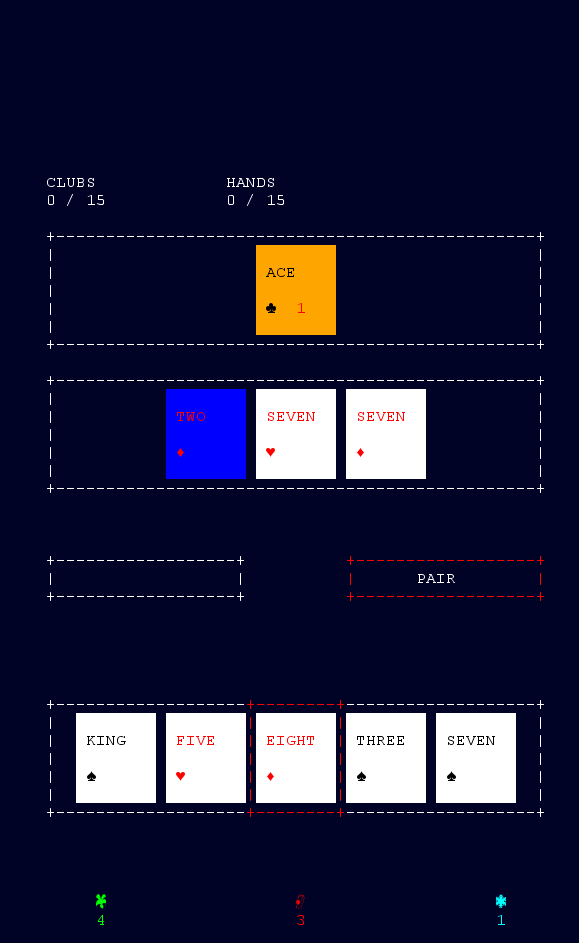
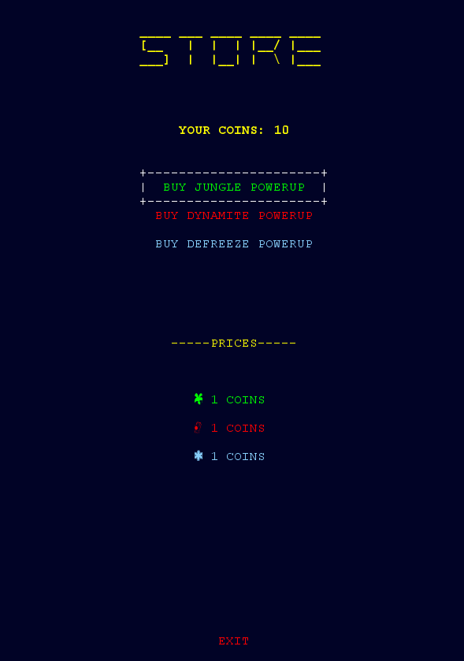
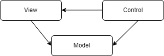
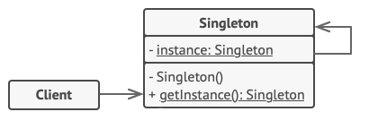
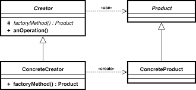
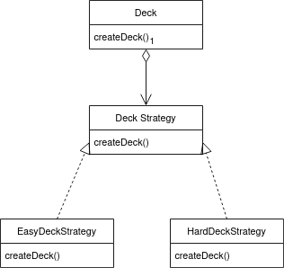

# LDTS_T12_G03 - POKER BOMB

## Game Description

The POKER BOMB is a card-like based game where you have to combine different cards to make poker-hands, completing the requests will give you the chance to level up and retrieve your rewards.
The variety of levels will have increased difficulty with different types of cards and requests.

This project was developed by Afonso Martins (up202005900@up.pt), Joao Pinheiro (up202008133@up.pt) and Alexandre Sa (up201905383@up.pt) for LDTS 2021-22.

## Game Screenshots

  

  <b><i>Fig 1. In-Game</i></b>

  

  <b><i>Fig 2. Game Store</i></b>

## Implemented Features

- **Menus** - The user has the capability of browsing through all the menus of the application (Main Menu, Instructions, Store, Level Selection, Game).
- **Buttons** - Functional and interactive buttons.
- **Keyboard control** - The user can use the keyboard to browse and interact with the options in the menu and to control the in-game commands. Inputs are received through the respective events and interpreted according to the current game state.
- **Shop and money management** - The player may buy new powerups in the store, using the coins earned by playing the game and completing levels.
- **Cards** - Several types of cards to deal with (jungle cards, dynamite cards , frozen cards).
- **Power Ups** - Implementation of power-ups (e.g. Unfreeze cards, add plays to dynamite cards, eliminate layers of jungle cards).
- **Levels** - The player can choose the level to play based on the quests of each one (displayed in the level selection screen).
- **Quests** - To complete a level, the player must complete a set of quests.
- **Cards and combinations logic** - The game can check for combinations of poker hands and determine if  acertain goal was achieved, updating the in-game quests.

## Planned Features (only the ones on this list were not implemented)

- **Multipliers** - Each card combination ( poker hand ) will have a multiplier. The hand-score is obtained by multiplying the base type-hand with the multiplier.
- **Animations** - Several animations are incorporated in this game, like card explosions, win and loss messages or level loading.
- **Seasons** - A season is determined by the number of levels passed and for each new season unlocks upgrades. New power-ups will be added to the game, or a free gift may be given to the player, like a money boost or a free power-up.
- **Build your own level** - We invite you to collaborate with us and make your level from scratch.

## Design Patterns

### MVC
#### Problem in context:
It is important to separate the data, interface and control of the game to have a more code reusability and to make the code more organized and easy to implement.

#### The pattern:
This design pattern is used to separate all the code in three elements(Model, View and Control). The Model does not have dependencies, the View depends on the Model, and the Controller depends on both the Viewer and Model.

#### Implementation:
The main directory of our project is sub-divided into three different directories for each of the pattern's components: Model, View and Controller.

  

  <b><i>Fig 3. MVC Pattern</i></b>

#### Consequences:
- Related actions are grouped together so the code is more organized. 
- The front-end and back-end can be done simultaneously. 
- The program becomes easier to modify because all three elements are separated from each other.

### Singleton

#### Problem in context:
We wanted to make sure that, during the execution of the game, all of the three PowerUps only have a single instance, so that the player can buy them in the store, use them, and the number of powerups will always be updated globally.
The player must also be a single instance, in order to manage its coins and interaction with the game effectively.

#### The pattern:
Just like a global variable, the Singleton pattern grants access to some object from anywhere in the program. However, it also protects that instance from being overwritten by other code.
As our code has access to the Singleton class, it is able to call the Singleton’s static method. So whenever that method is called, the same object is always returned.

#### Implementation:
Our "Player" and "PowerUp" classes both implement the Singleton pattern.

  

  <b><i>Fig 4. Singleton Pattern</i></b>

These classes can be found in the following files:
- [DynamitePowerUp](../src/main/java/com/pokerbomb/model/game/powerup/DynamitePowerUp.java)
- [FrozenPowerUp](../src/main/java/com/pokerbomb/model/game/powerup/FrozenPowerUp.java)
- [JunglePowerUp](../src/main/java/com/pokerbomb/model/game/powerup/JunglePowerUp.java)
- [Player](../src/main/java/com/pokerbomb/model/Player.java)

#### Consequences:
- We can be sure that the class has only a single instance.
- We gain a global access point to that instance.
- The singleton object is initialized only when it’s requested for the first time.

### Factory Method
#### Problem in a Context:
We needed to create various types of cards. Jungle, Frozen, etc. Our first version only handled with Normal Cards, so the code lived inside the Card class.
After a while, we decided to go creative. Our code would get full of conditionals that switch the app's behavior depending on the class objects.

#### The Pattern:
Factory Method is a creational design pattern that provides an interface for creating objects in a superclass, but allows subclasses to alter the type of objects that will be created.

#### Implementation:

  

  <b><i>Fig 5. Factory Method</i></b>

These classes can be found in the following file:
- [Card](../src/main/java/com/pokerbomb/model/game/cards/Card.java)
- [Normal Card](../src/main/java/com/pokerbomb/model/game/cards/CardGeneric.java)
- [Jungle Card](../src/main/java/com/pokerbomb/model/game/cards/JungleCard.java)
- [Dynamite Card](../src/main/java/com/pokerbomb/model/game/cards/DynamiteCard.java)
- [Frozen Card](../src/main/java/com/pokerbomb/model/game/cards/FrozenCard.java)
- [Card Factory](../src/main/java/com/pokerbomb/model/game/cards/CardFactory.java)
- [Normal Card Factory](../src/main/java/com/pokerbomb/model/game/cards/NormalCardFactory.java)
- [Jungle Card Factory](../src/main/java/com/pokerbomb/model/game/cards/JungleCardFactory.java)
- [Dynamite Card Factory](../src/main/java/com/pokerbomb/model/game/cards/DynamiteCardFactory.java)
- [Frozen Card Factory](../src/main/java/com/pokerbomb/model/game/cards/FrozenCardFactory.java)

We also used the same implementation in creation of States for MVC:
- [Controller State](../src/main/java/com/pokerbomb/controller/state/ControllerState.java)
- [Menu State](../src/main/java/com/pokerbomb/controller/state/MenuState.java)
- [Instructions State](../src/main/java/com/pokerbomb/controller/state/InsState.java)
- [Store State](../src/main/java/com/pokerbomb/controller/state/StoreState.java)
- [Select Level State](../src/main/java/com/pokerbomb/controller/state/SelectLevelState.java)
- [Game State](../src/main/java/com/pokerbomb/controller/state/GameState.java)
- [Game Win State](../src/main/java/com/pokerbomb/controller/state/GameWinState.java)
- [Game Over State](../src/main/java/com/pokerbomb/controller/state/GameOverState.java)
- [State Factory](../src/main/java/com/pokerbomb/controller/state/FactoryState.java)

#### Consequences:
The use of these patterns in the current design allow the following benefits:

- We can introduce new types of products into the program without breaking existing client code.
- We avoided tight coupling between the creator and the concrete products.
### Strategy Pattern

#### Problem in a Context:
Aiming for a way to change difficulty of the levels. We generate our decks with probabilities for each special card. This implementation
makes it possible to not only create this two difficulties but in the future implement more without ease.

#### The Pattern:
Strategy is a behavioral design pattern that lets you define a family of algorithms, put each of them into a separate class, and make their objects interchangeable.

#### Implementation:

  

  <b><i>Fig 6. Strategy Pattern</i></b>

These classes can be found in the following file:
- [Deck](../src/main/java/com/pokerbomb/model/game/deck/Deck.java)
- [DeckStrategy](../src/main/java/com/pokerbomb/model/game/deck/DeckStrategy.java)
- [EasyDeckStrategy](../src/main/java/com/pokerbomb/model/game/deck/EasyDeckStrategy.java)
- [HardDeckStrategy](../src/main/java/com/pokerbomb/model/game/deck/HardDeckStrategy.java)

#### Consequences:
The use of these patterns in the current design allow the following benefits:

- We could isolate the implementation details of an algorithm from the code that uses it.
- We can introduce new strategies without having to change the context.

## Testing

#### Screenshot of coverage report

  

  <b><i>Fig 7. Code coverage screenshot</i></b>

#### Screenshot of mutation testing report
[Mutation tests](../build/reports/pitest/202201161841/index.html)

  

  <b><i>Fig 8. Mutation Test screenshot</i></b>

## Self-evaluation

The work was divided in a mutual way and we all contributed with our best. It helped us to enrich our java and principle/pattern knwoledge, as well as our team work.

- Afonso Martins: 33.3%
- Alexandre Sá: 33.3%
- João Pinheiro: 33.3%
