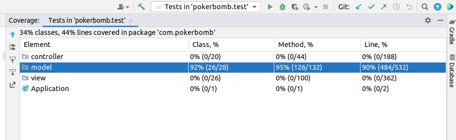
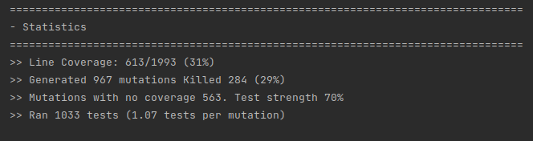

# LDTS_T12_G03 - POKER BOMB

## Game Description

The POKER BOMB is a card-like based game where you have to combine different cards to make poker-hands, completing the requests will give you the chance to level up and retrieve your rewards.
The variety of levels will have increased difficulty with different types of cards and requests.

This project was developed by Afonso Martins (up202005900@up.pt), Joao Pinheiro (up202008133@up.pt) and Alexandre Sa (up201905383@up.pt) for LDTS 2021-22.

## Implemented Features

## Planned Features

- **Connected Menus** - The user has the capability of browsing through the different menus including in game ones. (Ex: Menu, Instructions, Play, Shop and Pause).
- **Buttons** - Functional and interactive buttons.
- **Mouse and Keyboard control** - The mouse and keyboard inputs are received through the respective events and interpreted according to the current game state.
- **Different levels** - Different levels with an increasing difficulty will be implemented.
- **Quests** - To level up is a must complete the quests within the time.
- **Shop interaction and money management** - The player may buy new items in the in game shop, some of which consist of new power-ups and new multipliers.
- **Multipliers** - Each card combination ( poker hand ) will have a multiplier. The hand-score is obtained by multiplying the base type-hand with the multiplier.
- **Animations** - Several animations are incorporated in this game, like card explosions, win and loss messages or level loading.
- **Cards** - Several types of cards to deal with  (from time limited cards, to limited plays, frozen cards, ...).
- **Power Ups** - Implementation of power-ups (e.g. Unfreeze cards, stop the time, extra time).
- **Seasons** - A season is determined by the number of levels passed and for each new season unlocks upgrades. New power-ups will be added to the game, or a free gift may be given to the player, like a money boost or a free power-up.
- **Build your own level** - We invite you to collaborate with us and make your level from scratch.

## Implemented Features (until now)

- **Menus** - The user has the capability of browsing through the main menu and instructions menu. We will add the play and store menus when we fully develop those features.
- **Keyboard control** - The user can use the keyboard to browse the options in the menu and interact with some of them.
- **Cards and combinations logic** - The development of the logic that will check combinations between cards is almost fully developed, as the types of cards existent in the game.

## Design Patterns (until now)

- **MVC** - We started implementing the Model, View, Controller design pattern for some classes, but we plan to use it in the vast majority of our code.
- **State** - We started implementing the State design pattern for the Menu and Instructions. We will also implement a state which represents that a game is taking place and another that represents that the user is in the store.
- **Factory Method** - We started implementing the Factory Method design pattern for the Cards, we expect to use it along our project more times.

## Testing

### Screenshot of coverage report

  

  <b><i>Fig 6. Code coverage screenshot</i></b>

### Link to mutation testing report
[Mutation tests](../build/reports/pitest/202201090607/index.html)

  

  <b><i>Fig 6. Mutation Test screenshot</i></b>

